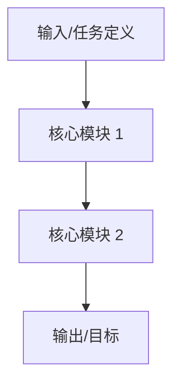

# 论文基本信息

> **原标题**: {论文完整英文标题}
> **作者**: {作者1、作者2、作者3...}
> **链接**: [{arXiv 链接}]({arXiv 链接})
> **发表时间**: {论文发表时间}

# 概述

介绍论文背景与要解决的问题。用 2-3 句话总结论文核心贡献。

# 背景知识（可选）

讲解读者需要了解的前置知识。说明现有方法的局限。

# 核心方法

讲解论文的主要思路。

## 模块 A

- 输入是什么
- 做了什么变换
- 输出到哪里
- 为什么这样设计

## 模块 B

同上。

# 实验与结果

## 实验设置

- 数据集
- Baseline
- 指标

## 主要结果

展示主要结果与分析。

## 消融实验（如有）

介绍消融实验设计与发现。

# 讨论

## 论文亮点

总结论文的亮点。

## 局限性与适用边界

说明局限性与适用边界。

## 对后续工作的启发

探讨对后续研究或应用的启发。

# 参考资料

- [相关资源](链接)
- [相关项目](链接)

---

> 本文采用了AI生成的文本，并全部经过人工审核编辑。
