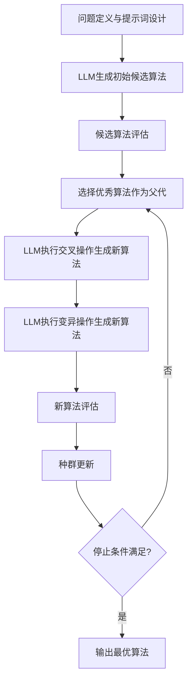

# 论文基本信息

> **原标题**: Evolution of Optimization Algorithms for Global Placement via Large Language Models
> **作者**: Xufeng Yao, Jiaxi Jiang, Yuxuan Zhao, Peiyu Liao, Yibo Lin, Bei Yu
> **链接**: [https://arxiv.org/abs/2504.17801](https://arxiv.org/abs/2504.17801)
> **发表时间**: 2025年4月

# 概述

优化算法广泛应用于解决复杂问题，但手动设计算法通常需要大量专业知识且耗费人力。全局布局是电子设计自动化（EDA）中的基础步骤，虽然解析方法代表了全局布局的当前最高水平（SOTA），但其核心优化算法仍然高度依赖启发式方法和定制化组件，如初始化策略、预处理方法和线搜索技术。本文提出了一个利用大语言模型（LLM）来演进全局布局优化算法的自动化框架，通过精心设计的提示词使用LLM生成多样化的候选算法，然后引入基于LLM的遗传流程来进化选定的候选算法。所发现的优化算法在多个基准测试集上表现出显著的性能提升【§1】。

具体而言，针对特定设计案例发现的算法在MMS、ISPD2005和ISPD2019基准测试集上分别实现了平均5.05%、5.29%和8.30%的HPWL（半周长线长）改进，在个别案例上甚至达到了17%的提升。此外，所发现的算法表现出良好的泛化能力，并且与现有的参数调优方法具有互补性【§1】。

# 背景知识

## 全局布局问题

在EDA设计流程中，全局布局是一个关键步骤，它决定了电路模块在芯片上的位置，对芯片的性能、功耗和面积都有重要影响。全局布局的目标通常是最小化总线长，同时满足密度约束等设计规则要求【§2】。

半周长线长（HPWL）是衡量布局质量的常用指标，它计算每个线网的边界框周长之和：
$$
\text{HPWL}(N) = \max_{p \in N} x_p - \min_{p \in N} x_p + \max_{p \in N} y_p - \min_{p \in N} y_p
$$
其中$N$表示一个线网，$p$表示线网中的引脚。

## 现有优化方法的局限

当前SOTA的全局布局算法主要基于解析方法，通常将布局问题转化为无约束优化问题，使用梯度下降等方法求解。然而，这些优化算法的设计高度依赖领域专家的经验，需要手动设计和调整大量的启发式组件，如：
- 初始化策略
- 预处理方法
- 线搜索技术
- 步长调整规则
- 停止条件

这些组件的设计不仅耗时，而且往往针对特定问题进行定制，难以泛化到不同的设计场景【§1, §2】。

## 大语言模型在算法设计中的潜力

近年来，大语言模型展现出强大的代码生成和逻辑推理能力，为自动化算法设计提供了新的可能性。LLM可以从大量的代码和算法文献中学习到丰富的设计模式和优化技巧，能够根据问题描述生成相应的算法实现【§1】。

# 核心方法

本文提出的框架主要包含两个核心阶段：
1. 候选算法生成阶段：使用LLM生成多样化的优化算法候选
2. 遗传进化阶段：使用LLM驱动的遗传流程对候选算法进行迭代优化

## 整体流程

## 候选算法生成阶段

在初始阶段，研究人员精心设计了提示词模板，引导LLM生成适用于全局布局优化的算法。提示词包含：
- 全局布局问题的描述
- 优化目标（最小化HPWL）
- 现有解析布局方法的基本框架
- 算法实现的接口要求
- 生成多样化算法的指令

通过这种方式，LLM可以生成多种不同结构和策略的优化算法候选，提供丰富的搜索空间【§3】。

## 基于LLM的遗传进化流程

遗传算法是一种常用的启发式优化方法，通过模拟自然选择和遗传变异过程来搜索最优解。本文创新性地将LLM作为遗传操作的执行者，实现了：

### 选择操作
根据算法在基准测试集上的性能表现，选择表现最好的若干个算法作为父代，进入下一代进化【§3.2】。

### 交叉操作
使用LLM对两个父代算法进行交叉，将它们的优秀特性组合到新的算法中。提示词会引导LLM分析两个父代算法的优缺点，然后融合它们的优势部分生成新的算法【§3.2】。

### 变异操作
使用LLM对单个算法进行变异，引入新的特性和策略。提示词会引导LLM分析当前算法的不足，然后提出改进方案，生成变异后的算法【§3.2】。

### 评估与种群更新
对新生成的算法在基准测试集上进行评估，根据性能选择保留的算法，更新种群，然后进入下一轮进化【§3.3】。

## 算法实现接口

为了便于自动评估，所有生成的算法都遵循统一的接口规范，包含：
- 初始化函数：设置算法参数
- 迭代步函数：执行一步优化迭代
- 停止条件判断函数：判断是否停止迭代
- 结果输出函数：输出最终布局结果

这种统一的接口使得算法可以自动集成到评估框架中，无需人工修改【§3.4】。

# 实验与结果

## 实验设置

### 基准测试集
实验使用了三个广泛使用的全局布局基准测试集：
- MMS基准集：包含多个现代工业设计案例
- ISPD2005基准集：经典的学术布局基准
- ISPD2019基准集：包含更大规模的设计案例【§4.1】

### Baseline方法
对比的Baseline包括：
- 经典的解析布局算法（如ePlace、RePlAce等）
- 手动调优的优化算法
- 自动参数调优方法【§4.1】

### 评估指标
主要使用HPWL（半周长线长）作为评估指标，同时考虑算法的运行时间【§4.1】。

## 主要结果

### 性能提升
实验结果表明，本文提出的方法发现的优化算法在各个基准测试集上都取得了显著的性能提升：
- MMS基准集：平均HPWL改进5.05%，最高提升12.3%
- ISPD2005基准集：平均HPWL改进5.29%，最高提升14.7%
- ISPD2019基准集：平均HPWL改进8.30%，最高提升17.0%【§4.2】

### 泛化能力测试
研究人员还测试了发现的算法在未见过的设计案例上的表现，结果显示算法具有良好的泛化能力，平均提升仍然达到3.2%，表明学习到的优化策略具有一定的通用性【§4.3】。

### 与参数调优方法的互补性
实验还发现，本文方法发现的算法与现有的参数调优方法具有互补性，将两者结合可以进一步提升性能，平均可以再获得1.5%的额外提升【§4.4】。

## 消融实验

为了验证各个组件的有效性，研究人员进行了详细的消融实验：

### 遗传操作的作用
- 仅使用初始生成的算法：平均提升2.1%
- 初始生成+交叉操作：平均提升3.8%
- 初始生成+变异操作：平均提升4.2%
- 初始生成+交叉+变异：平均提升5.8%

这表明交叉和变异操作都对性能提升有重要贡献，两者结合效果最好【§4.5】。

### 提示词设计的影响
研究人员还测试了不同提示词设计对生成算法质量的影响，发现包含领域知识和示例的提示词可以显著提升生成算法的性能【§4.5】。

# 讨论

## 论文亮点

1. **创新性的算法设计框架**：首次提出使用LLM来自动化进化全局布局优化算法的完整框架，为EDA领域的算法设计提供了新的思路。
2. **显著的性能提升**：在多个基准测试集上取得了显著的HPWL改进，部分案例提升超过15%，超过了手动设计的算法。
3. **良好的泛化能力**：发现的算法不仅在训练案例上表现优秀，在未见过的设计案例上也能保持较好的提升效果。
4. **与现有方法的互补性**：所发现的算法可以与现有的参数调优方法结合使用，进一步提升性能。【§5】

## 局限性与适用边界

1. **计算成本较高**：当前框架需要对大量候选算法进行评估，计算资源消耗较大。
2. **领域知识依赖**：提示词的设计仍然需要一定的领域知识，以引导LLM生成有效的算法。
3. **适用范围限制**：当前方法主要针对全局布局优化问题，如何扩展到其他EDA问题甚至更广泛的优化问题还需要进一步研究。【§5】

## 对后续工作的启发

1. **自动化算法设计的新方向**：本文展示了LLM在自动化算法设计方面的巨大潜力，未来可以将这种思路扩展到更多EDA领域和其他工程领域的算法设计问题。
2. **人机协作的算法设计模式**：LLM可以作为算法设计师的助手，帮助探索更大的设计空间，发现人类专家可能忽略的优化策略。
3. **算法知识的自动挖掘**：通过分析LLM生成的优秀算法，可以挖掘出新的算法设计模式和优化技巧，反哺人类专家的算法设计过程。【§5】

# 参考资料

- [ePlace: Electrostatics Based Placement Using Fast Fourier Transform](https://cseweb.ucsd.edu/~jlu/papers/eplace-tcad14.pdf) - 经典的解析布局算法
- [RePlAce: Advancing Solution Quality and Routability Validation in Global Placement](https://ieeexplore.ieee.org/document/8467418) - 现代SOTA全局布局算法
- [LLM for Code Generation](https://arxiv.org/abs/2206.07788) - 大语言模型代码生成相关综述

---

> 本文采用了AI生成的文本，并全部经过人工审核编辑。
