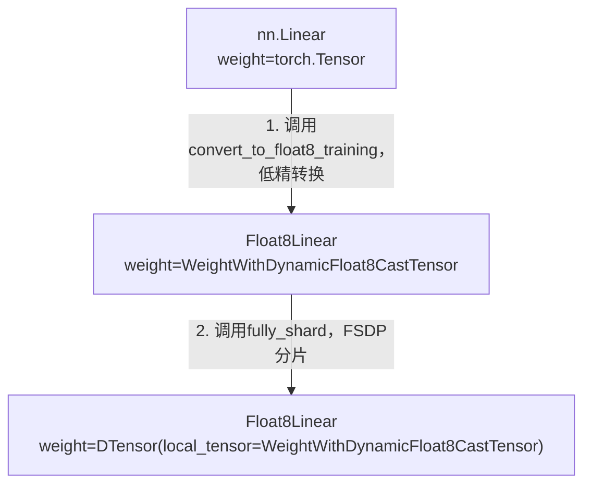
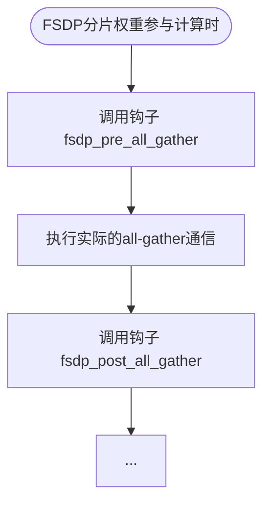

# 概述

本文档梳理TorchAO Float8训练叠加FSDP的流程，重点介绍当Float8和FSDP组合使用时的关键机制和实现细节。读者需要已经掌握FSDP特性，并且熟悉单卡TorchAO Float8训练的基本用法。

> 本文所分析之代码基于[TorchAO代码仓](https://github.com/pytorch/ao) `main`分支
> commit id: `1d75a0779f2e0095a08b3753f4a4f1b9666ccfe0`

# 背景知识

在Float8单卡训练中，Float8Linear模块通过将权重、输入和梯度动态转换为float8格式来执行矩阵。当与FSDP结合使用时，需要解决一个关键问题：FSDP的all-gather操作通常在原始精度（bfloat16）下进行，而我们希望在float8精度下进行all-gather以减少通信带宽占用。

torchao通过引入`WeightWithDynamicFloat8CastTensor`这一自定义Tensor子类，以及`precompute_float8_dynamic_scale_for_fsdp`函数来实现float8 all-gather优化。

通过使用`WeightWithDynamicFloat8CastTensor`，FSDP的all-gather在float8精度下进行，相比bfloat16：
- **通信带宽减半**: 每个元素只传输1字节而不是2字节
- **减少通信时间**: 大模型的FSDP并行训练通常部署在机框间，通信带宽通常是瓶颈

# 使能FSDP场景下float8 all-gather

## enable_fsdp_float8_all_gather配置

在`Float8LinearConfig`中有一个配置项：

```python
enable_fsdp_float8_all_gather: bool = False
```

当该配置被置为`True`时，权重会被包装为`WeightWithDynamicFloat8CastTensor`。在`Float8Linear.from_float()`方法中：

```python
if config.enable_fsdp_float8_all_gather:
    assert config.cast_config_weight.scaling_type is ScalingType.DYNAMIC
    new_mod.weight = torch.nn.Parameter(
        WeightWithDynamicFloat8CastTensor(  # 权重Tensor被替换为WeightWithDynamicFloat8CastTensor
            new_mod.weight,
            new_mod.linear_mm_config,
            new_mod.config.cast_config_weight.target_dtype,
        ),
        requires_grad=new_mod.weight.requires_grad,
    )
```

原始的weight Tensor被包装在`WeightWithDynamicFloat8CastTensor`中。这个`Tensor`子类实现了`fsdp_pre_all_gather`和`fsdp_post_all_gather`两个特殊方法，这是FSDP2支持自定义all-gather行为的接口。

> **约束**
> 在`Float8LinearConfig.__post_init__()`可找到以下约束：此配置目前只支持tensorwise（张量级）scaling，不支持axiswise（行级）scaling。
> ```python
> if self.cast_config_weight.scaling_granularity != ScalingGranularity.TENSORWISE:
>     assert not self.enable_fsdp_float8_all_gather, (
>         f"enable_fsdp_float8_all_gather only supports tensorwise scaling granularity, got {self.cast_config_weight.scaling_granularity}"
>     )
> ```

## WeightWithDynamicFloat8CastTensor的数据

`WeightWithDynamicFloat8CastTensor`是一个自定义Tensor子类，继承自`torch.Tensor`：

```python
class WeightWithDynamicFloat8CastTensor(torch.Tensor):
    def __init__(
        self,
        tensor: torch.Tensor,
        linear_mm_config: LinearMMConfig,
        dtype: torch.dtype,
        precomputed_scale: Optional[torch.Tensor] = None,
    ):
        self._tensor = tensor
        self._linear_mm_config = linear_mm_config
        self._dtype = dtype
        self._precomputed_scale = precomputed_scale
```

它是一个装饰器，包装了原始的Tensor，并通过`__torch_dispatch__`参与计算：绝大部分算子操作时都会先unwrap，然后使用原始Tensor进行运算。

## 相关Tensor的替换过程

以下是典型的Float8训练和FSDP组合使用时的权重结构变化：



**关键步骤**

1. 当`enable_fsdp_float8_all_gather=True`时，原始的权重Tensor被`WeightWithDynamicFloat8CastTensor`包装。这个子类持有：
   - `_tensor`: 原始的高精度权重数据
   - `_linear_mm_config`: 配置信息
   - `_dtype`: 目标float8类型
   - `_precomputed_scale`: 预计算的scale（可选）

2. 当应用FSDP2时，`DTensor`作为外层包装，`WeightWithDynamicFloat8`作为内层包装。这种嵌套结构允许：
   - FSDP处理分片和调用all-gather
   - WeightWithDynamicFloat8CastTensor处理Float8转换和低精all-gather

# 量化scale预计算

## `precompute_float8_dynamic_scale_for_fsdp`接口

`precompute_float8_dynamic_scale_for_fsdp`的作用是**预计算所有float8权重的scale**。带有预计算scale的权重在后续all-gather操作中，无需重新量化，可以节省开销。
该函数应该在一次epoch结束优化器更新权重之后、下一次epoch计算之前调用：
```python
output = model(input)
loss = output.sum()
loss.backward()
optim.step()
precompute_float8_dynamic_scale_for_fsdp(model)  # 推荐此时调用
```

## 实现原理

函数的核心逻辑如下：

```python
# 1. 找到所有符合条件的Float8Linear
float8_linears: List[Float8Linear] = [
    m
    for m in module.modules()
    if isinstance(m, Float8Linear)
    and isinstance(m.weight, DTensor)
    and isinstance(m.weight._local_tensor, WeightWithDynamicFloat8CastTensor)
]

# 2. 获取对应的权重DTensor
weights: List[DTensor] = [float8_linear.weight for float8_linear in float8_linears]

# 3. 计算每个权重局部最大绝对值，并将所有权重合并成一个大Tensor
max_weights = torch._foreach_norm(weights, ord=math.inf)  # Partial
amax_tensor = torch.stack(max_weights)  # Partial

# 4. 通过clamp触发DTensor的all-reduce
amax_tensor = torch.clamp(amax_tensor, EPS)  # Replicate

# 5. 计算Scale
scale_tensor = torch.finfo(target_dtype).max / amax_tensor  # Replicate

# 6. 将Scale存回每个WeightWithDynamicFloat8CastTensor
for i, float8_linear in enumerate(float8_linears):
    float8_linear.weight._local_tensor._precomputed_scale = local_scale_tensor[i]
```

**关键点**：在执行`torch.clamp(amax_tensor, EPS)`前，算子操作的是分片权重。当DTensor调用clamp时，PyTorch会自动执行一次all-reduce将各rank的部分结果合并为完整结果。

## 收益

如果不执行`precompute_float8_dynamic_scale_for_fsdp`，会有以下问题：

1. **多次vs单次**: 不使用预计算时，每个Float8Linear层都需要单独进行all-reduce；使用预计算时，所有层共享一次all-reduce。这节省了通信开销。
2. **计算冗余**: 在同一epoch中，权重没有变化，scale也不应该变化。预计算权重可以避免每次all-gather前反复重新计算。

使用预计算后的收益：
- **减少通信次数**: 从N次all-reduce减少到1次（N为Float8Linear层数）。
- **提高性能**: 避免了所有不必要的scale计算和通信开销。

# 低精all-gather的实现

## FSDP2的all-gather钩子

当FSDP2执行all-gather时，会调用以下流程：



FSDP2支持通过自定义Tensor子类的`fsdp_pre_all_gather`和`fsdp_post_all_gather`方法来定制all-gather行为。`WeightWithDynamicFloat8CastTensor`实现了这两个方法。

## `fsdp_pre_all_gather`：All-gather前将权重转为低精

```python
def fsdp_pre_all_gather(self, mesh):
    # 在all-gather之前，将权重从高精度转换为float8
    if (self._precomputed_scale is not None):
        ...  # 使用预计算的 scale
    else:
        ...  # 动态计算scale（不推荐，会有额外通信）
    # 返回要all-gather的低精data和scale。其中scale借用metadata的位置返回。
    return (float8_training_tensor._data,), (float8_training_tensor._scale,)
```

## `fsdp_post_all_gather`：All-gather后将数据重组以计算

```python
def fsdp_post_all_gather(
    self,
    all_gather_outputs: Tuple[torch.Tensor, ...],
    metadata: Any,
    param_dtype: torch.dtype,
    *,
    out: Optional[torch.Tensor] = None,
):
    (data,) = all_gather_outputs
    (scale,) = metadata
    if out is not None:
        # 如果提供了输出缓冲区，直接更新scale
        from torch.distributed._tensor import DTensor

        if isinstance(out, Float8TrainingTensor):
            out._scale = scale
        elif isinstance(out, DTensor) and isinstance(
            out._local_tensor, Float8TrainingTensor
        ):
            out._local_tensor._scale = scale
        else:
            raise RuntimeError(
                f"out must be a Float8TrainingTensor or DTensor(_local_tensor=Float8TrainingTensor), but got {out}"
            )
        return
    # 创建新的Float8TrainingTensor
    return Float8TrainingTensor(
        data,
        scale,
        param_dtype,
        self._linear_mm_config,
        gemm_input_role=GemmInputRole.WEIGHT,
    ), (data,)
```

# 前向反向全流程

## 前向Forward过程

1. **FSDP all-gather权重转为低精**
    - 如果`enable_fsdp_float8_all_gather=True`，调用`fsdp_pre_all_gather`
    - 如果有预计算的scale，使用预计算的scale转换为Float8；否则，动态计算scale并转换为Float8
    - 在Float8 精度下执行all-gather通信
    - 调用`fsdp_post_all_gather`，得到`Float8TrainingTensor`

2. **执行矩阵乘法**
    - 调用`torch.mm(input_Float8, weight_Float8)`
    - 触发`Float8TrainingTensor.__torch_dispatch__`
    - 调用`torch._scaled_mm`执行Float8矩阵乘法

3. **返回高精度结果**
    - `torch._scaled_mm`输出为高精度格式

## 反向Backward过程

Backward过程与forward类似，主要区别在于：
1. **grad_input计算**: 使用`grad_output`和`weight`进行矩阵乘法
2. **grad_weight计算**: 使用`input`和`grad_output`进行矩阵乘法

在Float8+FSDP场景下：
- `weight`已经是`Float8TrainingTensor`（来自all-gather），可以直接使用
- `input`和`grad_output`通常需要动态转换为Float8

# 关键代码位置索引

| 功能                                       | 文件                                        |
|--------------------------------------------|--------------------------------------------|
| `Float8LinearConfig`定义                   | `torchao/float8/config.py`                 |
| `enable_fsdp_float8_all_gather`配置        | `torchao/float8/config.py`                 |
| `Float8Linear.from_float`                  | `torchao/float8/float8_linear.py`          |
| `WeightWithDynamicFloat8CastTensor`定义    | `torchao/float8/fsdp_utils.py`             |
| `fsdp_pre_all_gather`方法                  | `torchao/float8/fsdp_utils.py`             |
| `fsdp_post_all_gather`方法                 | `torchao/float8/fsdp_utils.py`             |
| `precompute_float8_dynamic_scale_for_fsdp` | `torchao/float8/fsdp_utils.py`             |
| `matmul_with_hp_or_float8_args.forward`    | `torchao/float8/float8_linear.py`          |
| `Float8TrainingTensor.__torch_dispatch__`  | `torchao/float8/float8_training_tensor.py` |
| `float8_mm`(matmul实现)                    | `torchao/float8/float8_ops.py`             |

# FAQ

## 为什么Float8 all-gather只支持tensorwise scaling？

Axiswise scaling需要为每行维护独立的scale，这使得all-gather时需要额外做处理。当前实现没有做这些额外处理，而是直接裁剪掉了这类场景。

## 如果不调用precompute_float8_dynamic_scale_for_fsdp会怎样？

系统仍然可以工作，转为每次all-gather前动态量化weight、计算scale。这样性能会下降。每次all-gather时都会动态计算scale，产生额外的all-reduce通信开销。

## WeightWithDynamicFloat8CastTensor和Float8TrainingTensor有什么区别？

- `WeightWithDynamicFloat8CastTensor`: 仅用于FSDP权重，作为装饰器包裹原始高精度数据，实现FSDP all-gather钩子
- `Float8TrainingTensor`: 用于所有Float8数据计算（包括input、weight、grad_output），持有Float8数据和scale，实现matmul等操作

## FSDP all-gather时Float8数据的反量化发生在哪里？

FSDP all-gather传输的是Float8格式的原始数据，反量化发生在`torch._scaled_mm`内部，由硬件加速的Float8 kernel完成。

---

> 本文采用了AI生成的文本，并全部经过人工审核编辑。
