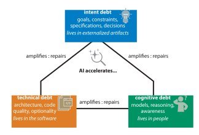

# 从技术债务到认知债务与意图债务：在 AI 时代重新思考软件健康

> **译者按：** 这是 ACM Queue 上 Margaret-Anne Storey 的一篇文章，探讨在 AI 时代软件健康的真正风险正从“代码层”向“人”和“交付件”迁移。作者提出一个“三重债务模型”：除了我们熟悉的技术债务（technical debt，代码里存在），还有长期被忽视的两类——认知债务（cognitive debt，团队的共享理解里存在）和意图债务（intent debt，缺失的交付件里存在）。生成式 AI 在加速生成代码、压低技术债务的同时，反而更快地积累这两类更隐蔽的债务，并掩盖其后果。
>
> 这篇文章对正在用 AI 开发的 Vibe Coder 尤其有参考价值：Agent替你写代码越快，你脑中与团队中的“实际理解”就越容易悄悄缩水。文章对认知债务的诊断信号、以及通过把隐性知识显性化来还债的实践，写得相当具体。
>
> 原文：[Storey, M.-A. 2026. From Technical Debt to Cognitive and Intent Debt: Rethinking software health in the age of AI. *ACM Queue* 24, 2 (June 2026). DOI: https://doi.org/10.1145/3807966](https://spawn-queue.acm.org/doi/10.1145/3807966)

> **关于作者：** Margaret-Anne Storey 是维多利亚大学计算机科学教授，加拿大“人与软件工程社会面”研究讲席教授。她是 SPACE 框架的合著者之一，也是开发者体验（DevEx）领域的代表性研究者。她的研究关注开发者与团队如何理解复杂软件系统，以及工具、AI 与协作实践如何塑造这种理解。她近期的工作考察生成式 AI 如何通过改变“理解的创建、共享与维护”方式来重塑软件工程。她与微软、DX 等业界伙伴合作，并获隆德大学荣誉博士。[ORCID 0000-0003-2278-2536](https://orcid.org/0000-0003-2278-2536)。

---

## 摘要

生成式 AI 正以前所未有的速度推动软件开发，让团队能以远超以往的速度生成和修改代码。过去几十年，软件工程的关注重心一直是管理技术债务（technical debt）——也就是代码结构与实现如何让系统变得更难改动。但在 AI 时代，技术债务或许已不再是最重要的约束。本文的主张是：真正的风险正在向两种更隐蔽的债务迁移——认知债务（cognitive debt）与意图债务（intent debt）。认知债务指团队内共享理解的侵蚀，导致没有人能自信地解释系统如何运作，或预测某次改动的影响。意图债务指清晰的目标、约束与理由的缺失——而这些正是说明“系统是为什么而存在、应如何演进”的关键，无论对人还是对 AI agent 而言。这两类债务一直存在，但生成式 AI 在加速它们积累的同时，还掩盖了它们的影响。本文提出如何在实践中识别这些债务，并给出团队可用来缓解它们的策略。

---

生成式 AI 正在大幅加快软件开发的速度，让小团队也能以前几年难以想象的节奏交付功能。[*[24]*](#ref-24) 我最近在一门创业课上亲眼见到了这一点。学生团队在一个学期里用 GenAI 工具加速开发，快速地交付功能、达成里程碑。到第八周，有个团队撞了墙：一些简单的改动竟在意料之外的地方把系统改坏了，进度因此停滞。他们最初将问题归咎于技术债务——代码混乱、实现仓促、架构取巧。

但当我们深入排查，浮现出的是另一个问题。团队里没有人能解释当初某些设计决策为何那样定，也无法说明系统的各部分本应如何协同。代码也许确实混乱，但更深层的问题是：团队的共享理解，也就是“系统的理论”[*[22]*](#ref-22)，已经悄然瓦解。他们也没有把决策背后的理由写下来或沟通清楚。他们积累认知债务和意图债务的速度，比技术债务还快，而这让他们陷入了僵局。

这并非个例。[*[33]*](#ref-33) 生成式 AI 并未消除软件工程的难题，而是把这些难题重新分配了。本文提出一个**三重债务模型**（见[*图 1*](#ref-img-1)）来分析软件的健康状况，该模型围绕三类相互作用的债务展开：技术债务（technical debt）指代码层的问题；认知债务（cognitive debt）指团队共享理解随时间的侵蚀；意图债务（intent debt）指目标、约束与理由的外化缺失，而人也好、AI 系统也好，都需要这些才能安全高效地与代码库协作。技术债务让系统更难改，认知债务让系统更难懂，意图债务则让人难以判断系统究竟是为什么而存在、是否仍在满足真实的用户需求。

*图 1：用于推断软件健康的三重债务模型。技术债务存在于代码里、认知债务存在于人身上、意图债务存在于artifacts里，三者相互作用、彼此强化。*

## AI 生成代码的隐性代价

多年以来，软件工程师一直在担心技术债务问题[*[6]*](#ref-6) 。团队重速度、轻质量，产生不断积累的混乱代码，带来了长期代价。但生成式 AI 或许正悄悄改变真正风险所在的位置。今天，AI 系统生成代码的速度，已经超过开发者阅读和理解它的速度；而随着模型进步，这些系统在自动化重构、测试生成和自动化代码审查方面降低债务的潜力也在不断显现。[*[14]*](#ref-14) 也就是说，生成式 AI 可能在压低技术债务的同时，反而加速了认知债务和意图债务的积累。组织对“生产力快速跃升”的期待，若没有配套的学习投入，便会制造出一种悖论：开发者没时间去建立理解，而理解本可真正为他们节省时间。[*[21]*](#ref-21)

代码也许能跑，架构也许还算合理。但团队也许并没有充分理解它是怎么运作的，也不记得当初设计它的初衷。久而久之，让一个软件系统“可安全改动”的那份共享理解，便悄然侵蚀。这种理解的渐失会推高认知债务，而决策理由的失传则带来意图债务。在 AI 辅助开发里，认知债务和意图债务或许正悄悄变成最要紧的风险。

### 软件系统究竟是什么

当开发者想象一个软件系统时，通常最先想到的是代码：实现功能的那些文件、函数和架构。但一个软件系统其实横跨三个不同的层：

- **目标与意图（goals and intent）**。系统本应满足的需求、约束与目标，由利益相关者持有，并记录在规格说明、测试和文档里。
- **代码与结构（code and structure）**。系统的表征与对其意图的实现：源代码、架构、依赖与部署基础设施，使系统得以运行。
- **共享理解（shared understanding）**。开发者、架构师、产品经理和其他利益相关者对系统如何运作、如何被推断所持有的动态心智模型——也就是 Peter Naur 所说的“系统的理论”[*[22]*](#ref-22)。重要的是，不需要任何一个人理解这三层的全部；真正要紧的是团队整体存在足够充分的共享理解，足以支撑安全改动与协调。

“技术债务”这一术语长期以来被用来描述第二层的问题。但一个软件系统的健康，取决于这三层的对齐与质量。意图不清，系统就会偏离它本来的目的。共享理解不足，团队就无法安全地推断改动，甚至不愿改动。系统也许能通过测试，但产品的行为却可能是错的。尽管技术债务确实是一个重要的问题，但失败并不仅是代码层的技术债务所致。

## 技术债务：众所周知的那一层

技术债务产生于开发者刻意或无意间的权衡——以长期代码质量换取短期交付。他们走了捷径，写出混乱或带坏味道的代码，并做出（或回避）会约束未来演进的架构决策。[*[18]*](#ref-18) 其论点是：如同财务债务，技术债务也会生息——拖得越久，改动系统的代价就越高。

技术债务虽麻烦，但由于它比较清晰的可识别性，是本文讨论的三类债务里或许最易管理的一种。软件工程社区也已发展出一套丰富、被广泛接受并经过验证的实践来管理技术债务：*[[2](#ref-2),[9](#ref-9)]* 测试驱动开发（test-driven development，TDD）、重构、代码审查等等。生成式 AI 也日益在这些方面贡献力量，提供自动化重构、识别代码坏味道与架构坏味道、生成测试等。抛开这份乐观，即便一个代码库技术债务很低，如果团队不理解它、或它已不再反映系统本意，它仍可能问题重重。

## 认知债务：难以察觉的那一层

认知债务是一种团队层面、项目层面的属性，反映的是一个软件系统的共享理解随时间的侵蚀。这种侵蚀表现为开发者赖以分析系统、并对其安全自信地改动的“共享心智模型”日益缺乏完善。个体开发者会把它体验为困惑、失控或信心下降，[*[27]*](#ref-27) 但债务本身栖身于团队整体共享理解与共识的缺口累积之中。这一框架借鉴了分布式认知理论（distributed cognition theory），该理论主张认知过程属于“人、artifacts及其交互”所构成的系统，而非单凭个体心智。[*[15]*](#ref-15)

认知债务一词也曾被用来描述 AI 辅助任务中个人思维参与度的下降。[*[17]*](#ref-17) 相关研究还把“理解债务（comprehension debt）”描述为开发者用 AI 能产出的代码与他们真正理解的部分之间日益扩大的鸿沟。[*[1]*](#ref-1) 但本文对该词的用法，聚焦于软件开发中团队层面与纵向的维度：一个软件系统的共享理解随时间累积的侵蚀。

开发者一直以来都在与不完整的、分布式的理解作斗争——无论是他们没有亲手建的遗留系统，[*[31]*](#ref-31) 还是用自己一知半解的库写出的软件，抑或从 Stack Overflow 抄来却没真正弄懂的方案。经典案例研究也观察到，软件系统依赖于分布式的人类理解，没有任何一个开发者理解整个系统。[*[7]*](#ref-7) 软件开发从来就不要求任何一个人理解整个系统；它所依赖的，是团队整体存在足够充分的共享理解，以支撑安全改动、协作和责任划分。

认知债务并非新事物；开发者长期就在对复杂系统不完整、分布式的理解下工作。新的是它积累的速度，以及在 AI 辅助开发中察觉它的难度。

生成式 AI 还以一种根本性的方式改变了认知债务相对于技术债务的重要性。当开发者从零手写代码，哪怕是混乱的代码，过程中的摩擦和付出意味着他至少会沿途建立某种心智模型。他会努力去理解代码想做什么，即便实现并不完美。而当 AI 生成同样的代码时，开发者可能在并未建立同等理解的情况下就接受了它。[*[27]*](#ref-27) 放大到整个团队、拉长到时间线上，这就在团队内部累积出一片“不知道”。代码能跑，但关于系统行为如何运作、如何分析的理解，却缺失或存在缺陷。

### 认知屈服导致认知债务

阅读和理解陌生代码是开发者所承担的认知负荷最重的活动之一，[*[12]*](#ref-12) 这也是为什么理解侵蚀现象如此重要。其背后的心理机制，是沃顿商学院的 Steven Shaw 和 Gideon Nave 所称的**认知屈服（cognitive surrender）**[*[26]*](#ref-26)：以最少的审视采纳 AI 的产出，而不经过直觉或推理过程（这借鉴了心理学家 Daniel Kahneman【译者注：《思考，快与慢》作者】[*[16]*](#ref-16) 对快速的直觉式“系统 1（System 1）思维”与更慢、更深思熟虑的“系统 2（System 2）思维”的区分）。

这与**认知卸载（cognitive offloading）**有重要区别。认知卸载是把一项独立任务策略性地交给工具（用 linter、类型检查器、拼写检查器）。认知卸载是理性的生产率选择。认知屈服也可以是刻意的，但它也可能导致对批判性介入的丧失。即便认知屈服是故意的，它而来的债务仍会悄悄积累。团队直到失去这些理解能力后才会意识到自己失去了什么。值得注意的是，Shaw 和 Nave 发现，即便 AI 是错的，认知屈服也会抬高信心——这恰好解释了为何认知债务会一直隐形、直至为时已晚：团队觉得自己对系统的理解，比实际更深。

与技术债务一样，认知债务也可能是在“理解”与“交付速度”之间刻意权衡后被刻意积累的。在我的创业课上，学生们理所当然地把精力放在对想法的快速反馈上，对认知债务并不那么在意。这样做的同时，他们也积累了意图债务，即未能保持对目标方向的共同理解。在大型组织里，由于认知债务的不可见性和规模问题，控制合理的认知债务量变得更加困难。

有效的解决问题要求开发者的问题模型与系统模型之间持续互动，彼此校正。当 AI 接手了方案构建，这条反馈回路就被切断，留给开发者的是一个对问题本身日益僵化的理解，[*[29]*](#ref-29) 同时也难以追踪整个团队中谁知道哪些信息。

### 认知债务如何诊断

认知债务比技术债务更难被看见和度量，因为它散落在人们的大脑中，并不直接呈现在代码库里。但它会留下一些可见的痕迹与信号：

- **抵触代码修改**。开发人员对系统的理解程度较低，可能会不愿意对系统进行修改。[*[27]*](#ref-27)
- **意想不到的结果**。认知债务的一个显著的信号是：团队成员进行某处修改后，预期会得到某种可观察的结果，但实际上却得到了完全不同的结果。[*[27]*](#ref-27)
- **上手缓慢或不可预测**。新成员尽管有相关文档说明，但仍然无法尽快上手工作。因为文档只是描述了代码的功能，而没有说明其背后的原理。团队里的其他人也帮不上新人多少忙。
- **交互记忆（transactive memory）的流失**。[[11](#ref-11),[32](#ref-32)] 团队成员难以记住每个人知道什么、系统是如何运作的，他们越来越依赖与 AI 的单独互动，而不是通过共享实践来协作。
- **卡车因子（bus factor）低**。只有一个人或极少数人真正了解这个系统，团队其他成员都会担心他们一旦离开会怎样。[*[28]*](#ref-28)

### 认知债务如何缓解

一些在处理技术债务时有效的做法在这里同样适用，例如：人工代码审查不仅有助于发现缺陷，还能促进团队之间的知识交流。结对编程也有类似的作用。不过，在处理认知债务时，团队还需要采用一些新的、有针对性的实践方法来提升理解：

- **以故障修复为设计目标**。保留“诊断可读性（diagnostic legibility）”[*[20]*](#ref-20)，因为开发者并不熟悉他们没写、却可能需要排查的代码。[*[27]*](#ref-27)
- **重新实现来修复认知债务**。既然生成代码的成本如今相对“低”，团队可以让 agent 用不同的测试方法或新的设计元素重写某个功能，从而帮助重建对系统的理解。
- **系统反串讲**。开发者对其他人写的代码进行组内串讲。这样做的主要目的是知识分享与理论构建[*[22]*](#ref-22)，而非编写文档或重构代码。
- **回顾与复盘**。当系统出问题或挑战时进行复盘，有助于让团队重建出问题的心智模型。
- **在软件实现、新人加入、成员离开交接期间进行有针对性的沟通**。通过这种建立共识的互动，暴露彼此理解上的差距。[*[5]*](#ref-5)

审视这些实践，有一个共同的主题逐渐显现：最能削减认知债务的方法，是那些把隐性知识显性化的方法。不要事后想着亡羊补牢，而要作为开发过程本身的一部分。也有从业者提出用 AI 来降低这些实践的成本、辅助理解。不过，人工智能不应完全取代人类在理解过程中所扮演的角色。将理解过程显性化，也是促使我们认识到第三类“债务”的原因，详见下文。

## 意图债务：被人忽视的那一层

还有一层债务需要被关注。随着 AI 系统在软件开发中扮承担更多职责，这层债务日益关键：**意图债务**指引导系统发展的明确理由、目标和约束条件发生缺失或模糊不清的现象。意图债务缺失的不只是相关背景信息和文档记录。当目标、约束、规格（特别是与用户需求相关的）不明确、描述不清，或者未被记录在人和 AI agent 都可查阅的文档中时，它就开始积累。随着意图债务积累，团队可能逐渐转向优化系统和流程，而忽视用户不断演进的真实需求。

有些从业者开始称之为**上下文债务（context debt）**，即缺少 AI agent 高效工作上下文中的信息。这种现象往往是意图债务的一部分。当下AI工具迫切需要意图的输入，正是 Marshall McLuhan 所说的技术“再现（retrieval）”现象[*[19]*](#ref-19)。随着新工具的出现，一些原本因技术变革而变得不那么必要的实践，又重新变得重要起来。随着生成式 AI 系统生成更多代码，捕获意图的实践，比如规格说明、测试、领域知识、设计理由等，可能再度变得关键。

技术债务存在于代码里，认知债务存在于人身上，意图债务则存在于残缺或缺失的非代码artifacts里。需求文档、架构决策记录、实现计划、测试、规格说明等artifacts，是一个系统本应做什么的外化记忆。当这些信息缺失、不完整、碎片化[*[35]*](#ref-35) 或过时，意图债务便无法偿还，系统也可能逐渐偏离其本来目的。此时，无论是开发者团队还是辅助他们的 AI agent，都得不到可靠的指导依据。

在软件工程中，意图债务也是一个常见的挑战，尤其对较大团队而言。软件项目需求不断变化，规格说明和决策难以被记录下来，目标和约束条件仅存在于少数关键利益干系人心中。意图最好在关键决策作出的那一刻被捕获并记录，因为事后再试图回溯它可能非常困难，甚至是不可能的（这与技术债务不同，技术债务是可以事后处理的）。

AI agent 成为软件开发的积极参与者，让应对意图债务的问题变得比以往更紧迫。无论是那些对系统理解不够的开发者，还是那些可能需要重构、扩展或测试系统的 AI agent，都需要系统的目的，而不仅仅是它当前的功能。如果没有这些信息，人类开发者可能难以建立有效的共同理解，而 AI 代理也可能朝着错误的目标进行优化。每一代 AI 辅助开发的产出，不仅会延续这份意图债务，还会使其复利增长。

### 意图债务如何诊断

意图债务可由几种模式识别：

- **系统行为偏差**。系统的行为与利益干系人的预期行为相偏离。这种偏差通常是在早期测试过程中才被发现的，甚至更糟糕的情况是在客户遇到问题时才发现问题。
- **AI agent 改不动**。如 AI agent 处理质量较差的代码时可能会遇到问题[*[4]*](#ref-4)的场景一样，Agent需要大量澄清才能理解问题和意图。此时，Agent产出的方案可能技术上正确，但实际抓不到问题的本质；Agent也可能因缺少上下文信息而消耗更多的 token 与时间。
- **已明确的约束失传**。性能预算、隐私约束、可访问性要求这类非功能性需求，只有少数人知道，逐渐被遗忘。

### 如何创建与维护意图artifacts

在依赖生成式 AI 之前，源代码常常通过命名和设计来承载人的意图。然而，当代码由 AI 生成时，意图可能就需要被明确表达。可以通过以意图为中心的工作流来实现这一点。要想偿还意图债务，就要投资于“活文档”，把目标、计划、约束与推理过程外化出来（类似于那些把知识本身视为结构化、可执行artifacts的新兴做法[*[35]*](#ref-35)）：

- **可执行的意图**。行为驱动开发（BDD）的规范和测试旨在明确目的，而不仅仅是验证行为。[*[34]*](#ref-34) 它们是体现意图的可执行artifacts，一旦测试失败，就可能表明系统已偏离其意图。
- **记录决策与理由**。架构决策记录（ADRs）会记录决定了什么、为什么、以及没有做什么。[*[23]*](#ref-23) 领域驱动设计（DDD）提供了另一种补充的做法：[*[8]*](#ref-8) 它的统一语言与协作式领域建模实践，在能够在代码实现之前明确表达出领域的意图。
- **面向 AI 辅助开发的上下文artifacts**。Harness 工程[*[3]*](#ref-3)是一种有效降低 AI 失败率的模式[*[10]*](#ref-10)，AI skills、agent 指令、playbook，以及从会议与对话中借助 AI 辅助捕获意图[*[30]*](#ref-30) 等，都是正在形成的实践方法，产出的artifacts可供人与 agent 共用。
- **让用户需求保持可见**。明确说明系统适用的场景、解决的问题，以及用户能够获得的成功体验是什么样子。不断重新审视相关假设和成功标准，将这些成果体现在能够指导开发者和Agent的artifacts中，并定期根据真实的用户反馈和结果来验证这些artifacts的准确性。少了这一步，系统可能一边演进、一边偏离用户的实际需求。

尽管前景可期，这些做法并不能替代那项艰苦的人的工作：决定系统是为什么而存在，并确保它的演进始终对齐用户不断演进的需求。[*[25]*](#ref-25)

## 软件系统健康三层模型

综合技术层面、认知层面以及意图层面的分析，我们可以构建一个用于评估软件系统健康状况的框架。这个框架超越了单纯关注代码质量和可修改性的范畴：

- **技术债务存在于代码里**。当实现决策限制了系统的可变性时，技术债务就会不断累积。这限制了系统变化的潜力。
- **认知债务存在于人身上**。当对系统的共同理解被侵蚀得比其补充的速度更快时，认知债务就会不断累积。这限制了团队对变化进行推理分析的能力。
- **意图债务存在于artifacts里**。当那些本应指导系统的目标和约束条件被误传或未能得到妥善维护时，意图债务就会逐渐累积。这限制了系统是否能够继续反映开发者创建系统的初衷、用户的需求，以及人类开发者和Agent如何继续有效改进该系统。

这三类债务是系统级属性，相互影响、彼此强化。分布式认知理论描述了认知过程如何属于“人、artifacts及其交互”所构成的系统。[*[15]*](#ref-15) 意图债务会引发认知债务：当系统目的没有被良好记录，新加入或刚回归的团队成员就无法对它形成准确的心智模型。

反过来，对系统意图缺乏理解的开发者，也无法外化规格、记录决策。认知债务会引发技术债务：当开发者不理解系统时，更可能做出糟糕的实现决策。而技术债务会放大认知债务：混乱代码更难推断，理解随之受损。技术、认知与意图债务之间的这种强化动态值得注意，每一类都有可能削弱或缓解其他两类（见[*图 1*](#ref-img-1)）。

因此，管理软件系统健康需要对这三层都主动关注，而不能只盯着最容易度量那一层。

## AI 如何打破平衡

如前所述，这三类债务并非全新事物，但生成式 AI 正在改变它们的相对重要性与积累速度。就管理技术债务而言，AI 展现出巨大潜力。自动化重构、AI 辅助代码审查、AI 生成的测试套件，能降低技术债务积累，并让改进遗留系统更容易。若这种趋势继续下去，有人相信 AI 会越来越多地替代开发者处理代码层面问题，降低维护代码质量的人力代价。

AI 可被用作缓解认知债务与意图债务的部分手段，但如果相关人员交出了自己的认知、又不主动捕获自己的意图，它也可能是一个风险倍增器。AI 生成代码的速度，超过了团队建立安全改动所需理解的速度。至少在今天，AI会接受规格不明确的提示词，填补空白，产生看似合理、却可能完全错失意图或系统所需的结果。随着 AI 接手越来越多的实现与文档工作，迫使开发者去理解代码、去思考意图的那套传统的反馈回路与摩擦机制，都会逐渐弱化。

## 对实践的影响

从业者能做什么？本文提出的系统健康评估框架为使用 AI 辅助开发的软件团队提供了几项可行的高优先方法：

- **将理解视为一种articact**。正如可运行的代码是软件开发的一项artifact，共享理解也应被视为一项artifact。这是团队需要明确投入精力去实现的目标，而不是仅仅作为编写代码的一个副产物。这意味着团队要为创建理解预留人力时间，包括反串讲、复盘会、加入/离开团队期间的知识交接，同时还需要投入资源来开发有助于重建理解的工具和软件设计原则。
- **意图优先的工作流**。在使用 AI 辅助或自动化开发时，尽早明确意图。ADRs、详细明确的规格、领域建模、决策依据、计划、清晰的用户验收标准，这些都是支撑人类理解的基础，也是人工智能代理进行有用工作的必要条件。
- **抵制把理解过程自动化**。人们很容易会想用 AI 同时生成文档与代码，从而提供关于系统功能的解释，而团队实际上并没有真正理解系统的运作机制。这种方式只是表面上呈现了“理解”的假象，事实上产生了更难被发现的认知债务。团队应对任何那种直接产生“理解”artifact的做法保持警惕，因为这些做法并没有伴随着必要的认知工作来构建重要的心理模型。未来，核心的开发者技能也许不再是写代码，而是维护一份关于“系统做什么、为什么、要如何演进”的正确理解。[*[13]*](#ref-13)
- **同步监控三层模型**。技术债务已有一套丰富的度量与监控工具生态。对认知债务与意图债务也应给予同等关注，可以通过跟踪投入时间、评估知识集中程度、分析需求覆盖情况，以及定期审核文档中的意图与实际行为之间的差距等方式来实现。至少，团队可以反思他们使用的各种实践方法，尽量减少上述三个相互关联层面的债务。如果只关注一部分实践方法，可能会导致一些他们意识不到的权衡取舍。软件系统依赖于记录在artifacts中的意图、体现在代码中的行为，以及分布在团队与其artifacts中的理解。当这三层要素被腐蚀或失去对齐，这三类债务就开始积累。

## 供练习使用的开放性问题

**该不该把“意图”文档化？**

并非所有从业者都认为记录意图是值得的。有人主张“怎么走到这里的不重要，只需关注向前需要哪些改动”，而他们所需要了解的信息，是可以被（重新）构造出来的。另一些人则记录意图很重要，而生成式 AI 或许能提供帮助。该不该、又如何把意图文档化，这场争论远未尘埃落定。

**AI 能否帮助把隐性知识显性化？**

有从业者提出，AI 能帮助揭示潜在的隐性知识，从而主动或被动地减少意图债务。另一些人则反驳说，创建文档的主要价值正在于过程中人所获得的理解。是否、以及如何用 AI 自动生成这类文档，仍是个开放问题。

**债务是风险，还是策略？**

本文把认知债务框定为一种需管理的风险，同时认为理解不存在于实现层面的细节、且是分布在团队成员与artifacts之间。另一些人则主张这种理解往往根本不需要，类似于管理者一直以来都需要信任团队成员一样。随着生成式 AI 自动化参与更多开发工作，“在某个组织或项目里可接受的债务量是多少”仍不确定。

## 结论

生成式 AI 有望在软件开发的速度与便捷性上带来非凡收益。然而同许多技术变迁一样，这些收益可能带有一个隐性的潜在问题：从技术债务转向认知债务与意图债务，因此，需要相应的工具与流程来解决这些问题。能够成功应对AI辅助开发时代的团队和组织，将是那些像重视代码质量一样，重视意图和理解的团队。在AI时代，维持健康的软件系统需要确保意图、代码和理解之间的时刻对齐。软件团队应该像重视代码质量一样，以同样的重视程度和紧迫感来管理对系统的理解。

## 致谢

我要感谢对早期草稿提供宝贵反馈与想法的同事：Adam Tornhill、Kent Beck、Daniel German、Dave Thomas、Marian Petre、Markus Borg、Mary Shaw、Roy Weil、Max Alexander-Kanat、Keith Mann 和 Ciara Storey。我也要感谢 Arty Starr，他的讨论帮助我打磨了本文的定义，他的工作也影响了我对“理解如何在实践中分解与重建”的思考。还要感谢 2026 年 2 月由 Thoughtworks 组织的 Future of Software Engineering 研讨会上给予洞见与反馈的同仁。

## 参考文献

1. Alakmeh, T. et al. Grasping AI reliance in program comprehension and coding through the AIRELI persona taxonomy. IEEE ICPC 2026, Rio de Janeiro, Brazil. 2026; https://aireli.hasel.dev/download/aireli-preprint.pdf
2. Beck, K. Extreme Programming Explained: Embrace Change. Addison-Wesley Professional 1999.
3. Böckeler, B. Context engineering. martinFowler.com. 2026; https://martinfowler.com/articles/exploring-gen-ai/context-engineering-coding-agents.html
4. Borg, M., Hagatulah, N., Tornhill, A., and Söderberg, E. Code for machines, not just humans: quantifying AI-friendliness with code health metrics. 2026. arXiv:2601.02200; https://arxiv.org/abs/2601.02200.
5. Clark, H. H. and Brennan, S. E. Grounding in communication. In Perspectives on Socially Shared Cognition, L. B. Resnick, J. M. Levine, and J. S. D. Teasley ed. American Psychological Association, 1991.
6. Cunningham, W. The WyCash portfolio management system. ACM SIGPLAN OOPS Messenger 4, 2 1993, 29–30; https://dl.acm.org/doi/10.1145/157710.157715.
7. Curtis, B., Krasner, H., and Iscoe, N. A field study of the software design process for large systems. Communications of the ACM 31, 11 1988, 1268–1287; https://dl.acm.org/doi/10.1145/50087.50089.
8. Evans, E. Domain-Driven Design: Tackling Complexity in the Heart of Software. Addison-Wesley, 2003.
9. Fowler, M. Technical debt. martinFowler.com. 2003; https://martinfowler.com/bliki/TechnicalDebt.html.
10. Garg, R. Patterns for reducing friction in AI-assisted development. martinFowler.com. 2026; https://martinfowler.com/articles/reduce-friction-ai/.
11. Herbsleb, J. D. Global software engineering: the future of socio-technical coordination. In Future of Software Engineering IEEE 2007, 188–198; https://dl.acm.org/doi/10.1109/FOSE.2007.11.
12. Hermans, F. The Programmer's Brain: What Every Programmer Needs to Know About Cognition. Manning Publications, 2021.
13. Hicks, C. M., Lee, C. S., and Foster-Marks, K. The new developer: AI skill threat, identity change & developer thriving in the transition to AI-assisted software development. PsyArXiv. 2024; https://osf.io/preprints/psyarxiv/2gej5_v2.
14. Hou, X. et al. Large language models for software engineering: a systematic literature review. ACM Transactions on Software Engineering and Methodology. 2024; https://dl.acm.org/doi/10.1145/3695988.
15. Hutchins, E. Cognition in the Wild. MIT Press, 1995.
16. Kahneman, D. Thinking, Fast and Slow. Farrar, Straus and Giroux, 2011.
17. Kosmyna, N. et al. Your Brain on ChatGPT: Accumulation of Cognitive Debt when Using an AI Assistant for Essay Writing Task. arXiv-2506.08872. 2025; https://arxiv.org/abs/2506.08872.
18. Kruchten, P., Nord, R.L., and Ozkaya, I. Technical debt: From metaphor to theory and practice. IEEE Software 29, 6 2012, 18–21; https://ieeexplore.ieee.org/document/6336722.
19. McLuhan, M. and McLuhan, E. Laws of Media: The New Science. University of Toronto Press, 1988.
20. Miles, R. On cognitive debt and the care of the habitat. A Software Enchiridion. 2026; https://www.softwareenchiridion.com/p/on-cognitive-debt-and-the-care-of.
21. Miller, C. et al. "Maybe we need some more examples:" individual and team drivers of developer GenAI tool use. IEEE/ACM Intern. Conf. on Software Engineering (ICSE 2026). arXiv:2507.21280. 2026; https://arxiv.org/abs/2507.21280.
22. Naur, P. Programming as theory building. Microprocessing and Microprogramming 15, 5 1985, 253–261; https://www.sciencedirect.com/science/article/abs/pii/0165607485900328.
23. Nygard, M. Documenting architecture decisions. Cognitect, 2011; https://cognitect.com/blog/2011/11/15/documenting-architecture-decisions.
24. Peng, S., Kalliamvakou, E., Cihon, P., and Demirer, M. The impact of AI on developer productivity: evidence from GitHub Copilot. arXiv:2302.06590. 2023; https://arxiv.org/abs/2302.06590.
25. Petre, M. and Shaw, M. Contrasting to spark creativity in software development teams. IEEE Software 42, 3 2025, 67–74; https://doi.org/10.1109/MS.2025.3538670.
26. Shaw, S. D. and Nave, G. Thinking—fast, slow, and artificial: how AI is reshaping human reasoning and the rise of cognitive surrender. The Wharton School Research Paper. Available at SSRN. 2026; https://papers.ssrn.com/sol3/papers.cfm?abstract_id=6097646.
27. Starr, A. and Storey, M. A. Theory of troubleshooting: the developer's cognitive experience of overcoming confusion. Accepted ACM Transactions on Software Engineering and Methodology 2026; https://dl.acm.org/doi/abs/10.1145/3800945.
28. Tornhill, A. Your Code as a Crime Scene. Pragmatic Programmers, 2015.
29. Tornhill, A. Skills rot at machine speed?. AI is changing how developers learn and think. Forbes, 2025; https://www.forbes.com/councils/forbestechcouncil/2025/04/28/skills-rot-at-machine-speed-ai-is-changing-how-developers-learn-and-think/.
30. Ulloa, M. et al. Product manager practices for delegating work to generative AI: "Accountability must not be delegated to non-human actors". IEEE/ACM Intern. Conf. on Software Engineering (ICSE 2026). arXiv:2510.02504. 2026; https://arxiv.org/abs/2510.02504.
31. von Mayrhauser, A. and Vans, A. M. Program comprehension during software maintenance and evolution. Computer 28, 8 1995, 44–55; https://dl.acm.org/doi/10.1109/2.402076.
32. Wegner, D. M. Transactive memory: a contemporary analysis of the group mind. In Theories of Group Behavior, B. Mullen and G. R. Goethals, ed. Springer New York, New York, NY. 1987, 185–208.
33. Willison, S. Cognitive debt. 2026; https://simonwillison.net/2026/Feb/15/cognitive-debt/.
34. Wynne, M., Hellesøy, A., and Tooke, S. The Cucumber Book: Behaviour-Driven Development for Testers and Developers, Second Edition. The Pragmatic Bookshelf, 2017.
35. Zhang, D. et al. Cloud Intelligence/AIOps 2.0: Knowledge-Anchored Agentic AIOps. To appear ACM FSE 2026 Workshop on Data Intensive Software Engineering (DISE). 2026.

---

> 本文采用了AI生成的文本，并全部经过人工审核编辑。
